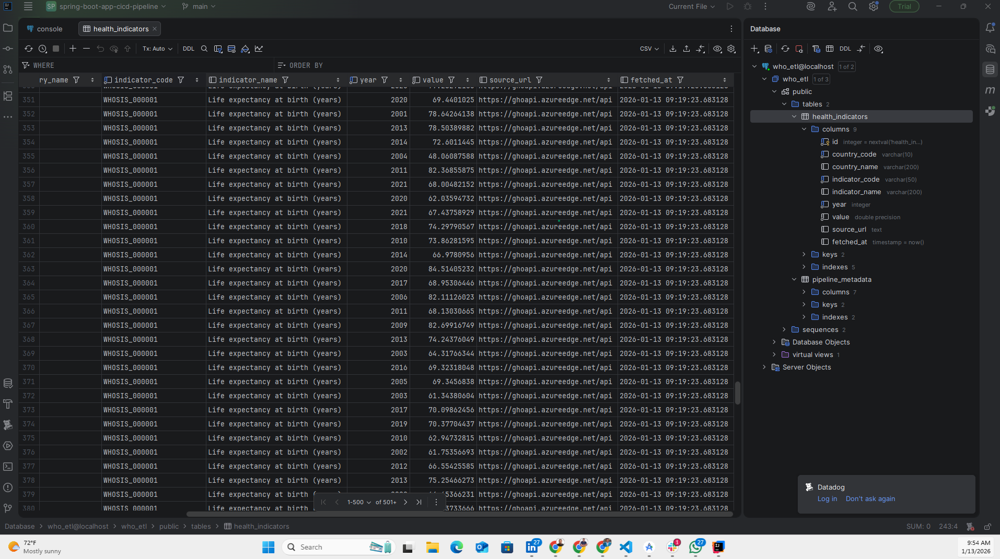

# WHO Health Data ETL Pipeline

ETL pipeline that extracts life expectancy data from WHO's GHO API and loads it into PostgreSQL.

## Quick Start

```bash
# Install dependencies
pip install -r requirements.txt

# Test without database (recommended first step)
python test_pipeline.py

# Set up database
createdb who_etl
python setup_db.py

# Configure connection (optional - defaults work for local postgres)
cp .env.example .env

# Verify database connection
python scripts/verify_db.py

# Run the pipeline
python main.py
```

## Project Structure

```
├── config.py              # Configuration and environment variables
├── extract.py             # API data extraction with pagination
├── transform.py           # Data validation and cleaning
├── load.py               # PostgreSQL loading with upserts
├── main.py               # Pipeline orchestrator
├── schema.sql            # Database schema
├── setup_db.py           # Database setup script
├── test_pipeline.py      # Quick smoke test
├── run_tests.py          # Test runner
├── scripts/              # Database helper scripts
│   ├── verify_db.py     # Connection checker
│   ├── create_db.py     # Database creation
│   ├── check_data.py    # Query loaded data
│   └── test_db_query.py # Test queries
├── screenshots/          # Project screenshots and demos
├── utils/                # Reusable utility modules
│   ├── http.py          # HTTP retry logic
│   ├── checkpoint.py    # Checkpoint management class
│   └── validation.py    # Data validation helpers
└── tests/
    ├── test_extract.py      # Unit tests for extraction
    ├── test_transform.py    # Unit tests for transformation
    └── test_integration.py  # Integration tests
```

## Design Decisions

**Data Source**: Chose life expectancy indicator (WHOSIS_000001) for its clean structure and global coverage.

**Checkpoint/Resume**: Pipeline saves progress after each API page. If it crashes, rerun to resume from last checkpoint instead of starting over.

**Idempotency**: Uses PostgreSQL upserts (ON CONFLICT) so reruns update existing data rather than creating duplicates.

**Retry Logic**: Exponential backoff for transient API failures (network issues, rate limits).

## Data Validation

Transform step removes:
- Null country codes or years
- Years outside 1900-2030 range
- Negative life expectancy values
- Duplicate country/year records

## Testing and Debugging

### Option 1: Quick Smoke Test (No Database Required)

Tests extraction and transformation with real WHO API data:

```bash
python test_pipeline.py
```

**What it does:**
- Fetches 50 records from WHO API
- Runs full transformation pipeline
- Shows sample input/output
- Verifies data structure

**Use this to:** Quickly verify the pipeline works without database setup.

### Option 2: Full Unit Test Suite (No Database Required)

Runs all 14 unit and integration tests:

```bash
python run_tests.py
```

**What it tests:**
- **Extraction (5 tests)**
  - HTTP retry with exponential backoff
  - Pagination stops at incomplete pages
  - Resume from checkpoint functionality
  - Maximum retries exhaustion handling
- **Transformation (7 tests)**
  - Empty input handling
  - Null value removal
  - Year range validation (1900-2030)
  - Negative value filtering
  - Duplicate record removal
  - Type conversions
  - Basic transformation correctness
- **Integration (2 tests)**
  - End-to-end extract → transform flow
  - Data structure compatibility between stages

**Output:** 14 tests passing, ~0.05s runtime

### Option 3: Full Pipeline Test (Database Required)

Complete ETL pipeline with PostgreSQL:

```bash
# Setup database
createdb who_etl
python setup_db.py

# Run pipeline
python main.py
```

**What it does:**
- Extracts all pages from WHO API (paginated)
- Transforms and validates data
- Loads into PostgreSQL with upserts
- Saves checkpoints for resume capability

**Verify results:**
```sql
-- Count loaded records
SELECT COUNT(*) FROM health_indicators;

-- Sample data
SELECT country_code, year, value
FROM health_indicators
LIMIT 10;
```

### Helper Scripts

Several utility scripts are available in the `scripts/` directory:

```bash
# Check database connection and view data
python scripts/verify_db.py

# Query and display loaded records
python scripts/check_data.py

# Create database if it doesn't exist
python scripts/create_db.py

# Test basic queries
python scripts/test_db_query.py
```

### Debugging Tips

**Check logs:** Pipeline outputs detailed logging at INFO level

**Resume after failure:** If pipeline crashes, just run `python main.py` again - it resumes from last checkpoint

**Clear checkpoint:** Delete checkpoint to start fresh:
```sql
UPDATE pipeline_metadata SET last_checkpoint = NULL WHERE pipeline_name = 'who_etl';
```

## What I'd Add for Production

- Incremental loads - only fetch new data since last run instead of everything
- Support for multiple health indicators, not just life expectancy
- Alerts when the pipeline fails (Slack, email, PagerDuty)
- Data quality checks - track completeness, outliers, unexpected patterns
- More detailed checkpoints if processing really large datasets
- Grafana dashboards for data visualization - charts showing trends, country comparisons, and data completeness metrics

## Design Trade-offs

Stuck with life expectancy data since it's clean and straightforward to work with. The WHO has tons of other health indicators, but one is enough to show how the pipeline works.

Everything gets reloaded each time the pipeline runs. Yeah, incremental updates would be smarter for production, but with only 50K records the full refresh takes seconds. Not worth the extra complexity of tracking what changed.

Pandas handles the transformations. Some people avoid it for ETL because of memory usage, but we're well under a gig of data so it's fine. The built-in type conversions and missing data handling save a lot of time.

Checkpoints happen after each 100-record page. Could checkpoint more often but that means more database writes for minimal benefit. Could checkpoint less often but then you lose more progress if something breaks.

Using upserts (INSERT ... ON CONFLICT) instead of delete-and-reload. Takes a few more lines of SQL but means we don't lose the original fetch timestamps and it's safer if someone else is reading the data.

Single-threaded execution. Could parallelize the API calls but that's asking for rate limit issues and makes debugging harder. Current speed is fine for the data volume.

No monitoring or alerts hooked up. Would definitely want Slack notifications or something similar before running this in production.

## Results

After running the pipeline, you'll have health indicator data loaded into PostgreSQL:



The pipeline successfully loaded 1,927 life expectancy records from WHO covering multiple countries and years.

## Verifying Results

```sql
-- Sample the loaded data
SELECT country_code, year, value
FROM health_indicators
ORDER BY country_code, year
LIMIT 20;

-- Check pipeline status
SELECT pipeline_name, status, records_processed, last_run_at
FROM pipeline_metadata;
```
